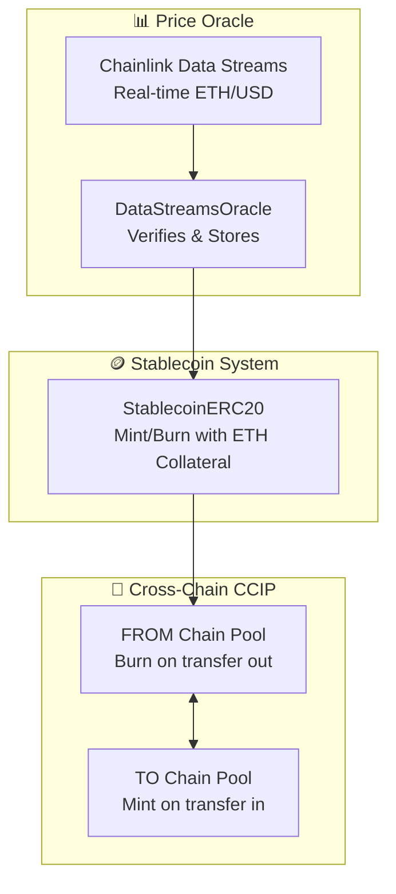

# Chainlink Oracle-Backed Cross-Chain Stablecoin Workshop
## EVM Implementation

> **📝 Note:** This is the **EVM version** of the Chainlink Data Streams-backed cross-chain stablecoin workshop. For the **Solana (SVM) version**, see [solana-stablecoin-workshop](https://github.com/smartcontractkit/solana-stablecoin-workshop).

## 🎯 Overview

This repository contains a **complete workshop implementation** of an **oracle-backed stablecoin system** that integrates **Chainlink Data Streams** for real-time ETH/USD price feeds and **Chainlink CCIP** for cross-chain token transfers between EVM chains.

**Built on Official Chainlink Tools:**
- **[Chainlink Data Streams](https://docs.chain.link/data-streams)** - Real-time ETH/USD price feed integration
- **[Chainlink CCIP](https://docs.chain.link/ccip)** - Cross-chain token transfer protocol

### Workshop Content
- **Real-time price integration** via Chainlink Data Streams
- **Oracle contract** for on-chain price verification and storage
- **Stablecoin contract** with ETH collateral management and minting logic
- **Cross-chain transfers** using Chainlink CCIP Burn & Mint pools
- **Chain-agnostic architecture** - deploy to any supported EVM chain pair

## ⚠️ Disclaimer

> **Educational Demo:** This tutorial represents an educational example to use a Chainlink system, product, or service and is provided to demonstrate how to interact with Chainlink's systems, products, and services to integrate them into your own. This template is provided "AS IS" and "AS AVAILABLE" without warranties of any kind, it has not been audited, and it may be missing key checks or error handling to make the usage of the system, product or service more clear. Do not use the code in this example in a production environment without completing your own audits and application of best practices. Neither Chainlink Labs, the Chainlink Foundation, nor Chainlink node operators are responsible for unintended outputs that are generated due to errors in code.

## 🚀 Get Started

**Ready to build?** Follow the complete step-by-step guide:

**[→ INSTRUCTIONS.md](./INSTRUCTIONS.md)** - Complete prerequisites, installation, and deployment walkthrough

### Quick Start Options

**Option 1: Dev Container (Recommended)**
- Zero setup required - opens with all dependencies pre-installed
- Works in VS Code, Cursor, or any Dev Container-compatible IDE
- Simply open in container and start the workshop

**Option 2: Local Setup**
- Follow the prerequisites section in [INSTRUCTIONS.md](./INSTRUCTIONS.md)
- Install Node.js, npm, and Git
- Clone and run `npm install`

## 📁 Project Structure

```
stablecoin-workshop-evm/
├── README.md                    # This overview
├── INSTRUCTIONS.md              # Complete step-by-step workshop guide
├── .devcontainer/               # Dev Container configuration (optional)
├── contracts/                   # Solidity smart contracts
│   ├── DataStreamsOracle.sol    # Chainlink Data Streams oracle
│   ├── StablecoinERC20.sol      # Oracle-backed stablecoin
│   └── interfaces/              # Contract interfaces
├── scripts/                     # Deployment and utility scripts
│   ├── deploy-oracle.ts         # Deploy DataStreamsOracle
│   ├── deploy-stablecoin.ts     # Deploy StablecoinERC20
│   ├── update-oracle.ts         # Update oracle with latest price
│   ├── mint-stablecoin.ts       # Mint stablecoin with ETH collateral
│   ├── check-balance.ts         # Check stablecoin balance
│   ├── check-collateralization.ts # Check collateral status
│   └── utils/                   # Helper utilities
├── smart-contract-examples/     # CCIP integration (Chainlink submodule)
└── hardhat.config.ts           # Hardhat configuration
```

## 🏗️ System Architecture



## 📚 Workshop Phases

The workshop covers end-to-end deployment across two EVM chains:

### Phase 1: FROM Chain Deployment
- Deploy DataStreamsOracle contract
- Deploy StablecoinERC20 contract
- Configure oracle with price feed
- Mint stablecoin with ETH collateral

### Phase 2: TO Chain Deployment
- Deploy contracts on second chain
- Configure oracle and stablecoin

### Phase 3: CCIP Setup
- Deploy TokenPools on both chains
- Configure cross-chain routing
- Register tokens in TokenAdminRegistry

### Phase 4: Cross-Chain Operations
- Execute cross-chain transfers
- Verify balances on both chains
- Monitor collateralization status

## 🎯 Workshop Learning Objectives

By completing this workshop, you will learn how to:

- ✅ Integrate Chainlink Data Streams for real-time price feeds
- ✅ Build an oracle-backed stablecoin with collateral management
- ✅ Deploy contracts across multiple EVM chains
- ✅ Configure Chainlink CCIP for cross-chain token transfers
- ✅ Implement Burn & Mint cross-chain token pools
- ✅ Manage cross-chain token routing and administration

## 🔗 Resources

- [Chainlink Data Streams Documentation](https://docs.chain.link/data-streams)
- [Chainlink CCIP Documentation](https://docs.chain.link/ccip)
- [Hardhat Documentation](https://hardhat.org/docs)
- [Solidity Documentation](https://docs.soliditylang.org/)

## 📝 License

This project is licensed under the MIT License - see the [LICENSE](./LICENSE) file for details.

